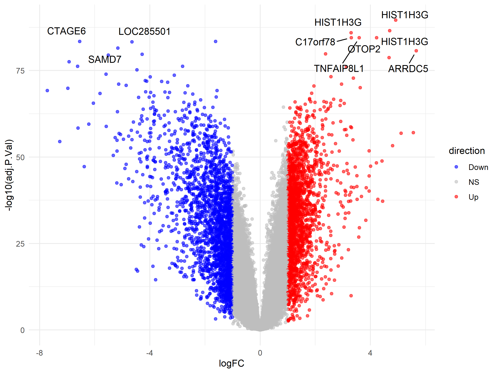
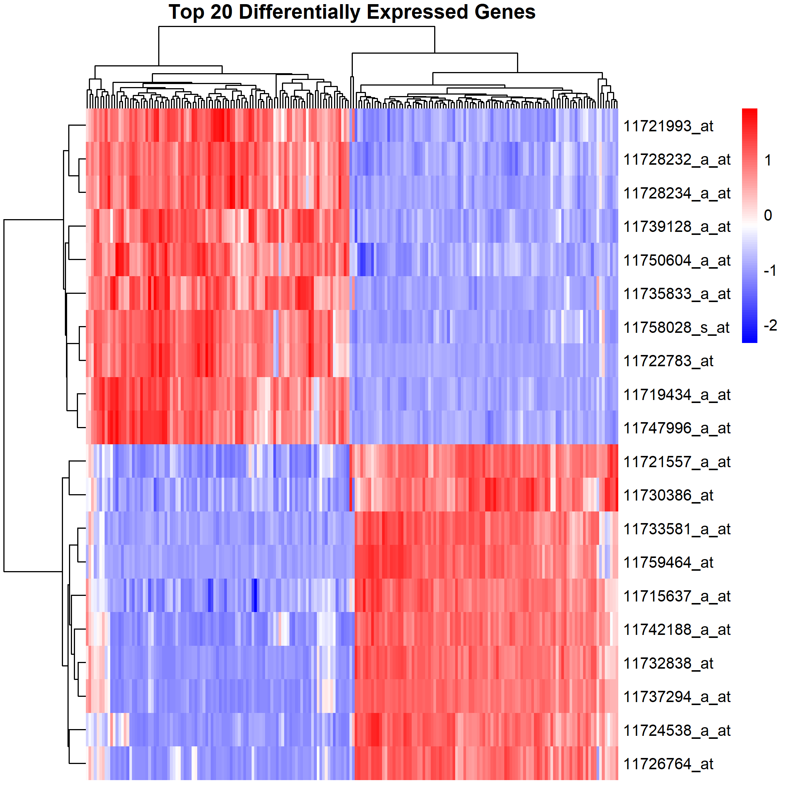
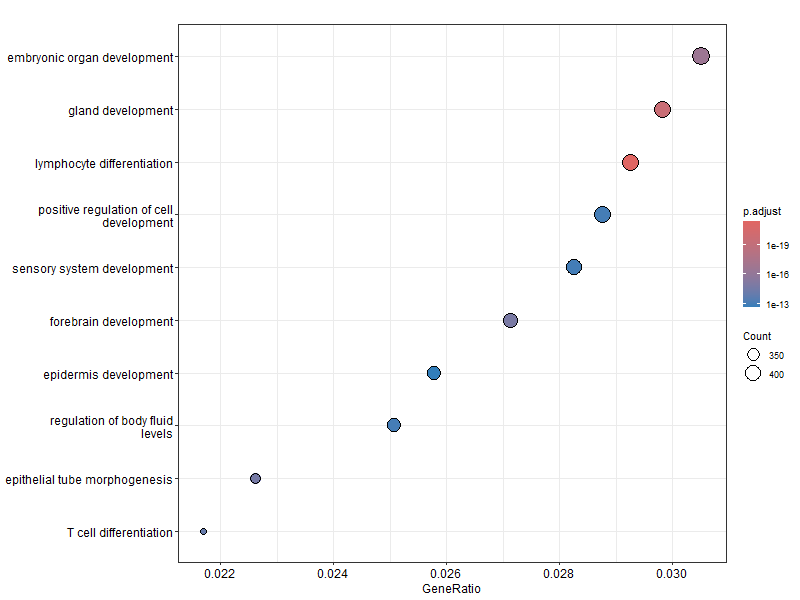

# Gene Expression Analysis (Tumor vs Normal)

## Overview
This project performs differential gene expression analysis using GEO dataset (GSE44076) in R.

## Methodology
- Downloaded dataset using GEOquery
- Selected Tumor and Normal samples
- Applied differential expression analysis using limma
- Identified significant genes (adj p-value < 0.05)
- Visualized results using volcano plot and heatmap
- Performed Gene Ontology (GO) enrichment analysis

## Results

### Volcano Plot

### Heatmap (Top 20 Genes)

### GO Enrichment Analysis

## Key Findings
- Several genes show strong upregulation and downregulation
- Top genes clearly separate Tumor vs Normal samples
- GO analysis shows enrichment in:
  - Embryonic organ development
  - Gland development
  - Immune-related processes

## Files
- analysis.R → Full R script
- DEG_results.csv → All gene results
- top20_genes.csv → Top genes used in heatmap

## Tools Used
- R
- GEOquery
- limma
- ggplot2
- pheatmap
- clusterProfiler
